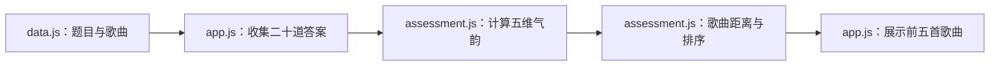
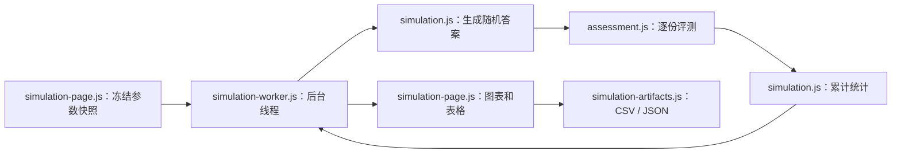

# 架构说明

## 项目是什么

GFTI 是一个静态网页项目。它有两条相互关联的流程：

- 普通评测：参与者回答二十道题，页面计算五维气韵并推荐五首契合歌曲。
- 模拟诊断：开发者批量生成均匀随机答案，统计一百首歌曲成为第一名或进入前五的频率。

两条流程调用同一个评测模块。模拟功能没有复制计分公式，因此修改算法时只有一个地方需要改。

## 先认识几个概念

模块是一个有明确输入和输出的代码文件。例如，`assessment.js` 接收题目、歌曲和答案，返回五维气韵与歌曲排序。

UI 是用户看到并操作的页面。UI 负责读取输入、显示进度和渲染结果，不负责定义计分公式。

Web Worker 是浏览器里的后台线程。最多一百万次模拟放在 Worker 中运行，主页面仍能响应点击和取消操作。

`localStorage` 是浏览器提供的本地存储。歌曲参数后台把临时调整保存在这里，数据只属于当前浏览器。

## 文件分工

### 数据与评测

| 文件 | 职责 | 不应该放入的内容 |
| --- | --- | --- |
| [`data.js`](../data.js) | 五个维度、二十道题、选项权重和歌曲参数 | 页面点击逻辑、统计逻辑 |
| [`assessment.js`](../assessment.js) | 根据答案计算五维气韵，计算歌曲距离和排序 | DOM 操作、`localStorage`、随机生成 |
| [`app.js`](../app.js) | 普通评测页面状态、答题交互、结果展示、歌曲参数后台 | 新的计分公式 |
| [`index.html`](../index.html) | 普通评测和歌曲参数后台的结构与样式 | 算法实现 |

### 模拟诊断

| 文件 | 职责 | 不应该放入的内容 |
| --- | --- | --- |
| [`simulation.js`](../simulation.js) | 固定种子随机答案、批量评测和统计汇总 | DOM 操作、文件下载 |
| [`simulation-artifacts.js`](../simulation-artifacts.js) | CSV、JSON 的导入导出和两份报告的比较 | 评测公式、页面状态 |
| [`simulation-worker.js`](../simulation-worker.js) | 在后台线程调用评测与模拟模块，发送进度和结果 | 图表 HTML、业务公式副本 |
| [`simulation-page.js`](../simulation-page.js) | 参数选择、Worker 生命周期、图表、表格和下载 | 距离或相似度公式 |
| [`simulation.html`](../simulation.html) | 模拟诊断页面结构与样式 | 批量统计实现 |

### 测试与文档

| 路径 | 用途 |
| --- | --- |
| [`tests/assessment.test.cjs`](../tests/assessment.test.cjs) | 锁定当前评测输出和排序规则 |
| [`tests/simulation.test.cjs`](../tests/simulation.test.cjs) | 验证固定种子、汇总和参数快照 |
| [`tests/simulation-artifacts.test.cjs`](../tests/simulation-artifacts.test.cjs) | 验证 CSV、JSON 与报告比较 |
| [`tests/*.integration.spec.cjs`](../tests/) | 在真实浏览器中操作两个页面 |
| [`docs/adr/`](./adr/) | 保存不容易从代码中看出的设计决定 |

## 普通评测如何运行



页面按 `data.js`、`assessment.js`、`app.js` 的顺序加载脚本。`data.js` 把数据放在 `window.GFTI_DATA`，`assessment.js` 把接口放在 `window.GFTIAssessment`，最后由 `app.js` 连接数据、算法和页面。

`assessment.js` 同时支持浏览器和 Node.js：

- 浏览器通过 `window.GFTIAssessment` 使用它。
- Node.js 测试通过 `require('../assessment.js')` 使用它。

两种环境加载的是同一个文件。测试不会维护一份单独的算法副本。

## 模拟诊断如何运行



点击“开始模拟”后，页面先复制题目和歌曲参数。这份副本叫参数快照。即使另一个标签页随后修改了歌曲参数，本次运行仍使用开始时的快照。

页面把快照、样本数和随机种子发送给 Worker。Worker 创建评测实例，再让 `simulation.js` 逐条生成答案并调用 `assessment.js`。普通统计不会把最多一百万条答案全部留在页面内存中。

用户点击“导出 samples.csv”时，Worker 使用同一个种子重放这批答案，按需生成明细文件。导出完成后，页面不长期保存明细。

## 歌曲参数从哪里来

`data.js` 中的歌曲参数是原始参数。歌曲参数后台可以把修改保存到浏览器的 `localStorage`，键名是：

```text
gfti_songs_override_v1
```

普通评测默认使用当前生效参数，即“原始参数 + 本地覆盖”。模拟诊断页也默认使用当前生效参数，但可以切换到原始参数。

报告会保存实际使用的歌曲参数快照。看到两份统计不同，先比较报告中的 `source` 和 `songSnapshot`，不要直接认定算法变了。

## 为什么不能直接双击 simulation.html

模拟页需要创建 `simulation-worker.js`。多数浏览器不允许 `file://` 页面加载 Worker 脚本，因此下面的地址不能可靠工作：

```text
file:///D:/myCode/github-project/GFTI/simulation.html
```

请通过 HTTP 打开：

```text
http://127.0.0.1:8777/simulation.html
```

GitHub Pages 本身使用 HTTPS，不受这个问题影响。

## 版本和交换格式

`assessment.js` 公开 `algorithmVersion`。修改评测公式、计分方式或排序规则时要更新它；只改颜色、文案或布局时不要更新。

模拟文件使用 `schema_version`。字段结构变化且旧文件不能按原规则读取时，要增加版本号，并为旧版本给出迁移或明确错误。

相关决定见 [`ADR-0001`](./adr/0001-versioned-simulation-artifacts.md)。

## 修改时必须守住的边界

- `assessment.js` 不读取页面、浏览器存储或随机数。
- `simulation.js` 不操作 DOM，也不负责下载文件。
- UI 不复制计分、距离、相似度或排序公式。
- Worker 只做线程适配，不维护另一套算法。
- 测试通过公开接口验证行为，不调用私有辅助函数。

以后增加 WebGPU 时，应把它作为新的计算适配层，并继续返回与 `simulation.js` 相同的汇总结构。页面、文件格式和评测公式不应依赖 GPU 是否可用。

如果一段新代码不知道放哪里，先看它的输入和输出。计算结果属于算法或模拟模块；点击、提示和 HTML 属于页面；CSV 和 JSON 属于交换格式模块。
